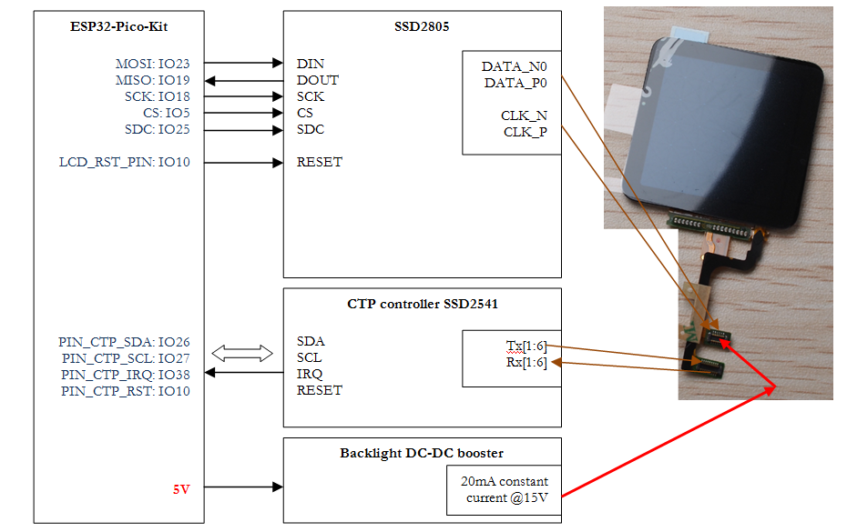
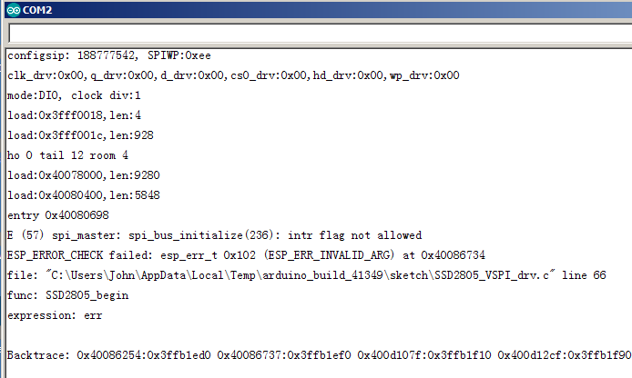
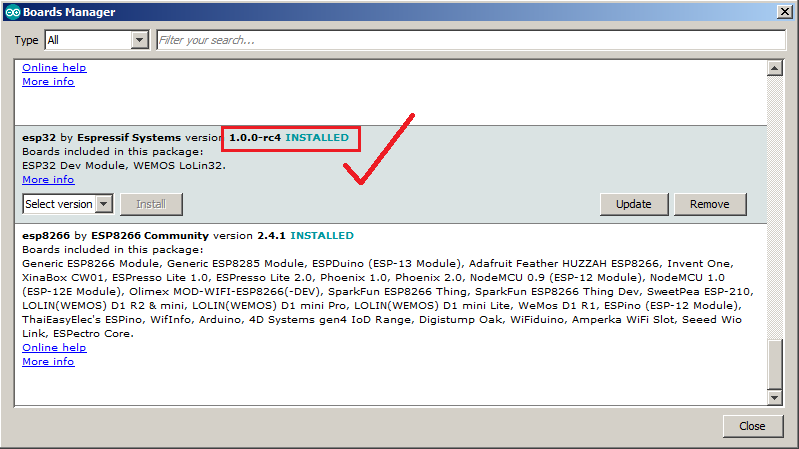
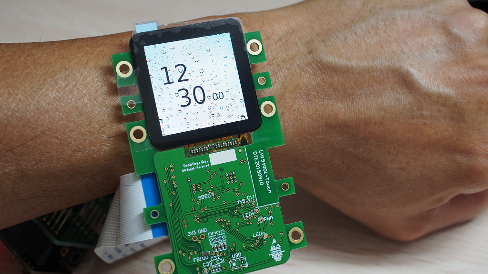

# SSD2805 Basic Demo

## Purpose
This program demonstrates the ability of ESP32's hardware SPI module to drive a MIPI LCD. Previously I have developed a 8080 parallel driver and successfully ported it to [LittlevGL framework](https://blog.littlevgl.com/2019-02-02/use-ipod-nano6-lcd-for-littlevgl). This time, I am going to switch it to VSPI running the same primitive demo and later port it for Arduino-compatible version of LittlevGL, all in Arduino IDE. Those GPIO pins saved from 8080 parallel driver will be used for OV2640 cmos camera module in upcoming demos. 

## Interface diagram

 

### Hardware Required
SSD2805+SSD2541 demo kit with ESP32-Pico-kit.

### Compiler
Arduino ESP32 core v1.0.0-4c4, Arduino IDE 1.8.1. 
It is not the latest ESP32 core the better. For some unknown reason, an update to core v1.0.1 has failed to compile this demo. ESP32 got repeat reset with error message as shown below: 
 

**Please keep it v1.0.0 or v1.0.0-rcx. Specifically I tried v1.0.0-rc4 and it works OK.** 
 
#### Pin Assignment:
MOSI :	GPIO23 
MISO :	GPIO19 
SCK  :	GPIO18 
CS	 :	GPIO5 
SDC  :	GPIO25 
RST  :	GPIO10 (share with SSD2541 for hw reset) 
TE   :	GPIO37 (reserve for future optimization) 

### Build and Flash
(1) First, make sure ESP32 Arduino core has been installed. 
(2) Select ESP32 Pico Kit from Board Manager. 
 
(3) From Sketch->Upload. 

## Example Output
Right now it is a dummy smartwatch. The LCD size of 1.54" looks nice on my wrist. Clock digits are fixed to the background but it is just a step ahead to make it run with LittlevGL in next demo. 
